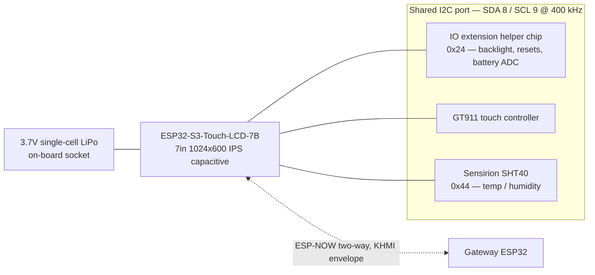

# Kelvin HMI — Wiring Diagram

Waveshare ESP32-S3-Touch-LCD-7B wall panel. Part of the [Kelvin Project Wiring Diagram.md](Kelvin%20Project%20Wiring%20Diagram.md) set.

---

## Wiring

- Display, touch controller, and battery socket are integrated on the Waveshare board — no external display wiring.
- The **SHT40 connects to the board's I2C port**, sharing the single bus with the IO extension chip and the GT911 touch controller.

## I2C bus

| Device                   | Address | Role                                           |
| :----------------------- | :------ | :--------------------------------------------- |
| IO extension helper chip | 0x24    | Backlight, touch/LCD reset, SD CS, battery ADC |
| GT911                    | —       | Capacitive touch controller                    |
| Sensirion SHT40          | 0x44    | Temperature / humidity                         |

All three share SDA 8 / SCL 9 at 400 kHz. The panel library is configured to skip its own I2C host init and reuse the bus the firmware already brought up, since installing the driver twice on one port fails.

## Power

Battery percentage is a **linear voltage estimate** from the helper chip's ADC register between 3.2V and 4.2V, not a fuel gauge. "External power present" is inferred at ≥ 4.15V; there is no dedicated status line to wire.

## Telemetry

Polls every 60 seconds; sends temperature, humidity, and battery on change or at the 5-minute heartbeat. No CO2 sensor — the panel reports 0 for that field.

Two-way: sends mode, fan, setpoint, schedule, and forecast-lockout changes upstream; receives thermostat configuration, HVAC call state, and system-wide average readings back.
