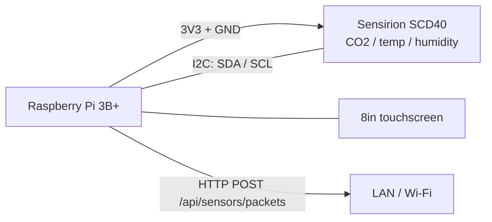

# Kelvin Kiosk — Wiring Diagram

Raspberry Pi 3B+ kiosk with CO2 sensing and a local UI. Part of the [Kelvin Project Wiring Diagram.md](Kelvin%20Project%20Wiring%20Diagram.md) set.

---

## Wiring

## Notes

- Mains-powered, so there is no battery telemetry to wire or report.
- The SCD40 is the only CO2 source in the system — Nodes and HMIs report 0 for that field.
- Kiosks **do not** go through the ESP32 gateway. They post sensor packets straight to the server over HTTP, so the only "link" to wire is network connectivity.
