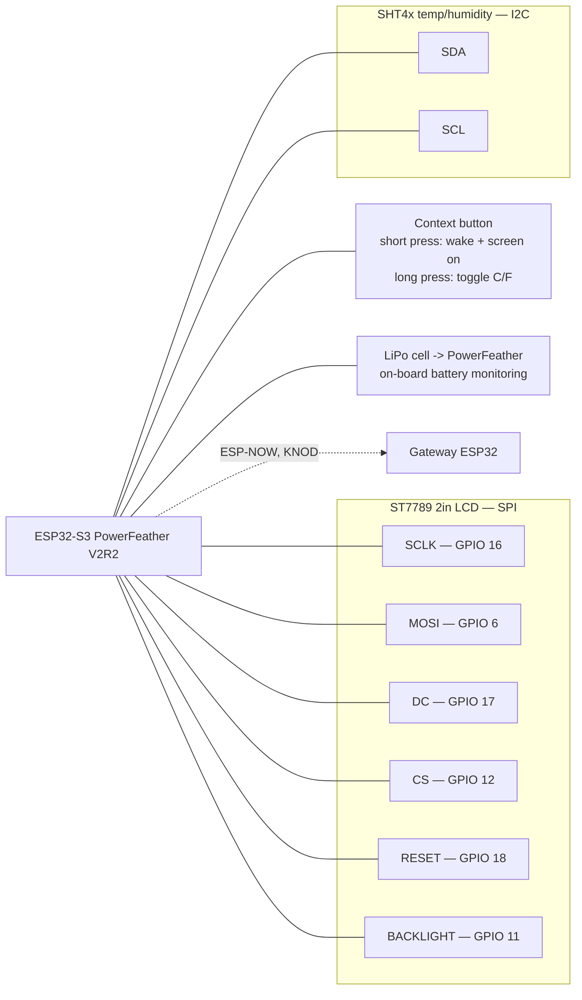

# Kelvin Node — Wiring Diagram

ESP32-S3 PowerFeather V2R2 battery-powered environmental sensor node. Part of the [Kelvin Project Wiring Diagram.md](Kelvin%20Project%20Wiring%20Diagram.md) set.

---

## Wiring

## Pin map

| Signal        | Pin                          |
| :------------ | :--------------------------- |
| LCD SCLK      | 16                           |
| LCD MOSI      | 6                            |
| LCD DC        | 17                           |
| LCD CS        | 12                           |
| LCD RESET     | 18                           |
| LCD Backlight | 11                           |
| SHT4x         | I2C (SDA/SCL, board default) |

The display and sensor share 3V3 and GND from the PowerFeather. Battery state of charge comes from the PowerFeather's on-board monitor, not an external divider.

## Telemetry

Reads every 60 seconds; sends on change or at the 5-minute heartbeat.

| Metric             | Delta trigger |
| :----------------- | :------------ |
| Temperature        | ± 0.5°C       |
| Humidity           | ± 1.0%        |
| Battery percentage | ± 5%          |

No CO2 sensor — the Node reports 0 for that field.
