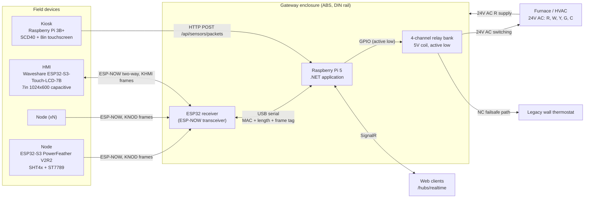
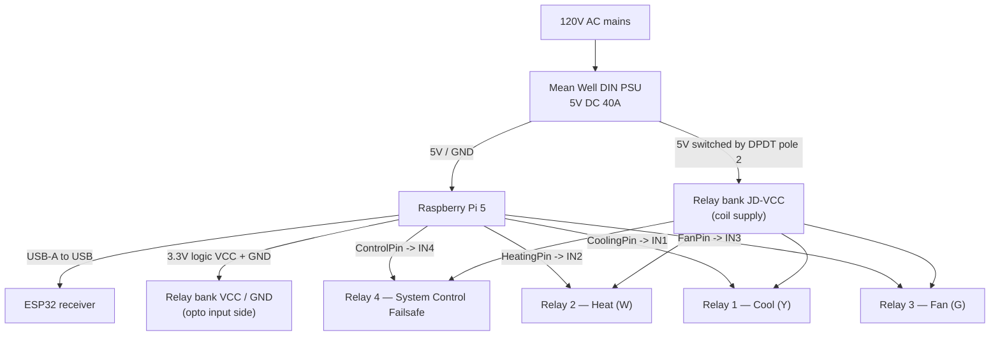
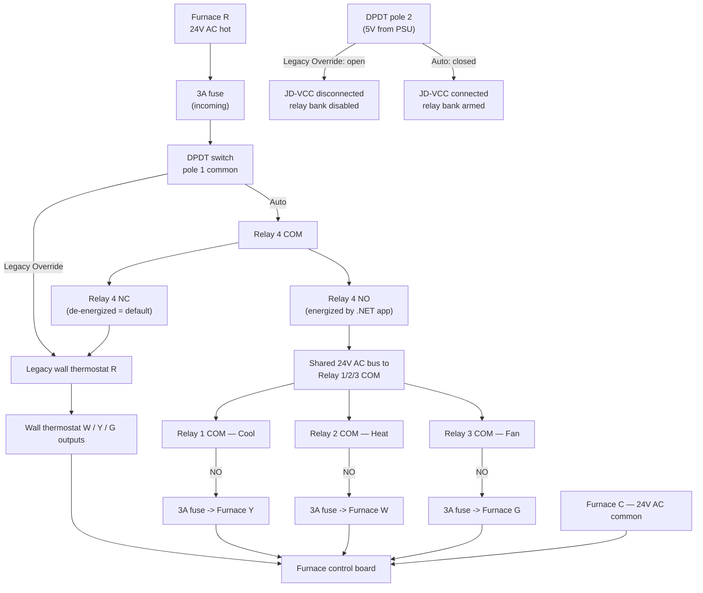
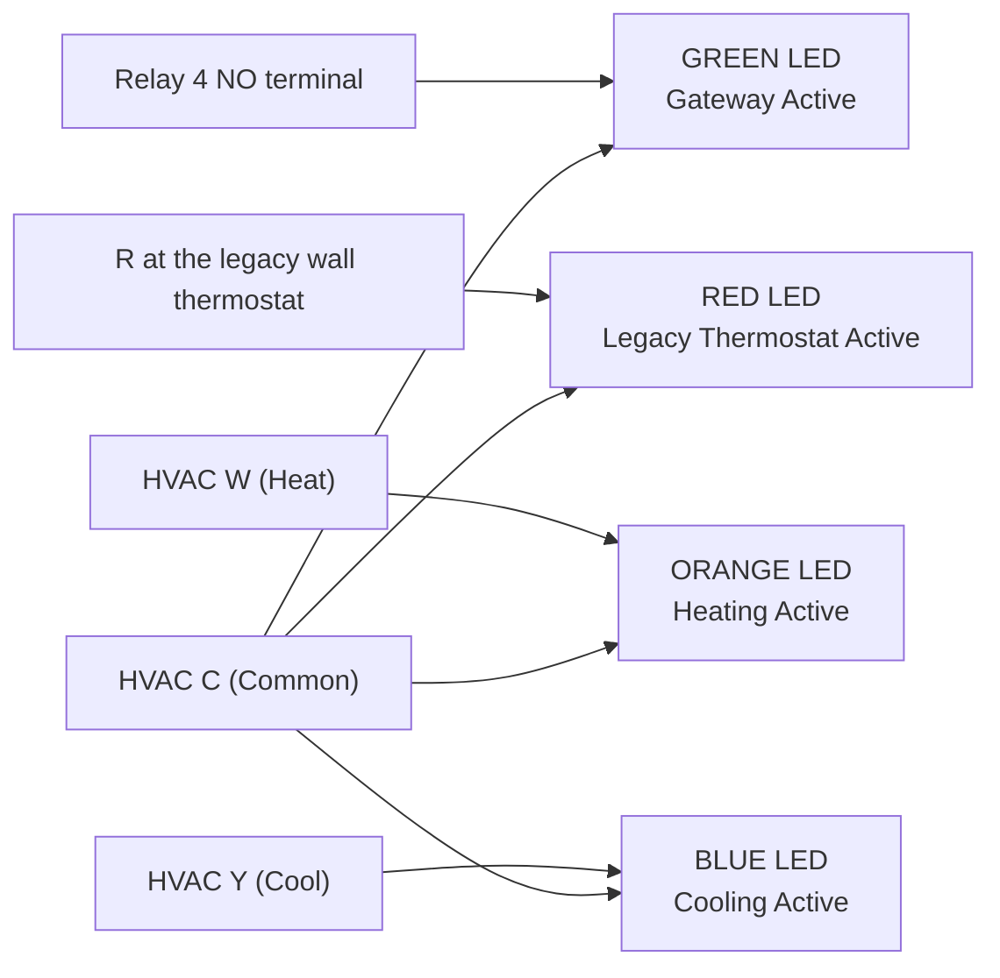
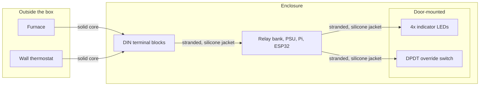
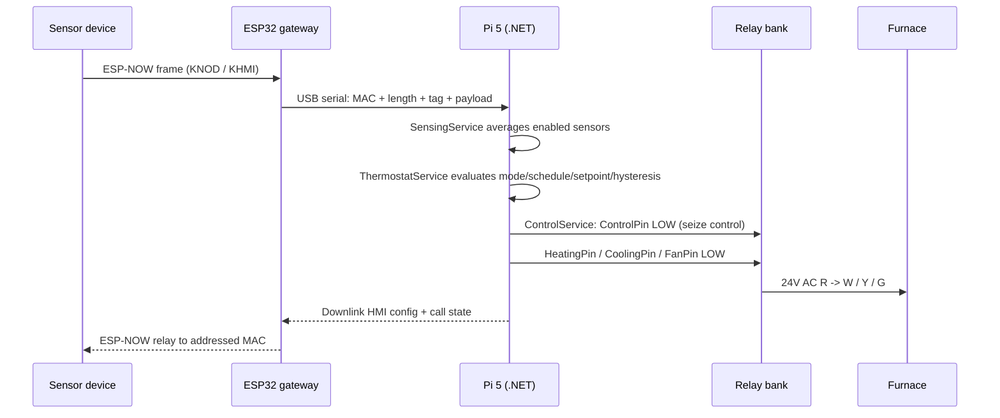

# Project Kelvin — Wiring Diagrams

Derived from [Kelvin Project Reference Guide.md](Kelvin%20Project%20Reference%20Guide.md). Everything below reflects the **intended** build as described in that guide.

This file covers system topology and the gateway enclosure. Per-device wiring lives in:

- [Kelvin Node Wiring Diagram.md](Kelvin%20Node%20Wiring%20Diagram.md) — ESP32-S3 PowerFeather V2R2, ST7789 SPI display, SHT4x
- [Kelvin HMI Wiring Diagram.md](Kelvin%20HMI%20Wiring%20Diagram.md) — Waveshare ESP32-S3-Touch-LCD-7B, shared I2C bus
- [Kelvin Kiosk Wiring Diagram.md](Kelvin%20Kiosk%20Wiring%20Diagram.md) — Raspberry Pi 3B+, SCD40

---

## 1. System topology

Kiosks deliberately bypass the ESP32 gateway and talk straight to the server over HTTP.

---

## 2. Gateway enclosure — DC power and logic

**Notes**

- The relay board is **active low**: the server drives a pin **LOW** to energize a relay, **HIGH** to release it (`RelayController`).
- GPIO assignments are not hard-coded. `HeatingPin`, `CoolingPin`, `FanPin`, and `ControlPin` live in the `Gateway` record in the database and are applied at runtime, so record the actual BCM numbers used on the build.
- Remove the **VCC–JD-VCC jumper** on the relay board so the opto-isolator input side is powered from the Pi while the coil side is powered from the PSU through the DPDT switch. This is what lets the "Legacy Override" position fully disable the relays.
- The Pi's GND and the PSU GND must be common for the GPIO signals to be referenced correctly.

---

## 3. Gateway enclosure — 24V AC HVAC control path

This is the tiered control system: DPDT manual override **in series with** the software-controlled Relay 4.

**Failsafe behavior**

| Condition                                      | Result                                                                                                                 |
| :--------------------------------------------- | :--------------------------------------------------------------------------------------------------------------------- |
| DPDT in **Legacy Override**                    | 24V AC routed straight to the wall thermostat; JD-VCC cut, relay bank completely dead.                                 |
| DPDT in **Auto**, Relay 4 de-energized         | Relay 4 NC hands 24V AC to the wall thermostat. This is the state after a Pi crash, power loss, or thermostat Disable. |
| DPDT in **Auto**, Relay 4 energized (GPIO LOW) | Relay 4 NO feeds the COM of Heat/Cool/Fan; Kelvin owns the HVAC.                                                       |

Relays 1–3 can only pass current when both the DPDT switch is in Auto **and** Relay 4 is energized, so there is no path for software to call heat while the user has chosen manual override.

---

## 4. Indicator lights (24V AC)

| LED    | Tap point                                                     | Lit when                                                                   |
| :----- | :------------------------------------------------------------ | :------------------------------------------------------------------------- |
| Green  | Relay 4 **NO** terminal, referenced to C                      | DPDT in Auto **and** the .NET app has seized control                       |
| Red    | R wire where it enters the legacy thermostat, referenced to C | Either the DPDT switch or Relay 4 has handed control back to the wall unit |
| Orange | Parallel across W and C                                       | Relay 2 bridges R→W                                                        |
| Blue   | Parallel across Y and C                                       | Relay 1 bridges R→Y                                                        |

Green and Red are mutually exclusive — they are the two sides of the Relay 4 transfer contact.

---

## 5. Enclosure conductor and connector rules

- **Solid core**, exclusively, for furnace entry lines and wall-thermostat exit lines, landed directly on dedicated DIN terminals.
- **Stranded copper with silicone insulation** for all internal routing, for flex life and to avoid metal fatigue.
- 3A fuses on the incoming 24V AC line and on each outgoing 24V AC line back to the furnace.

---

## 6. Signal flow summary

